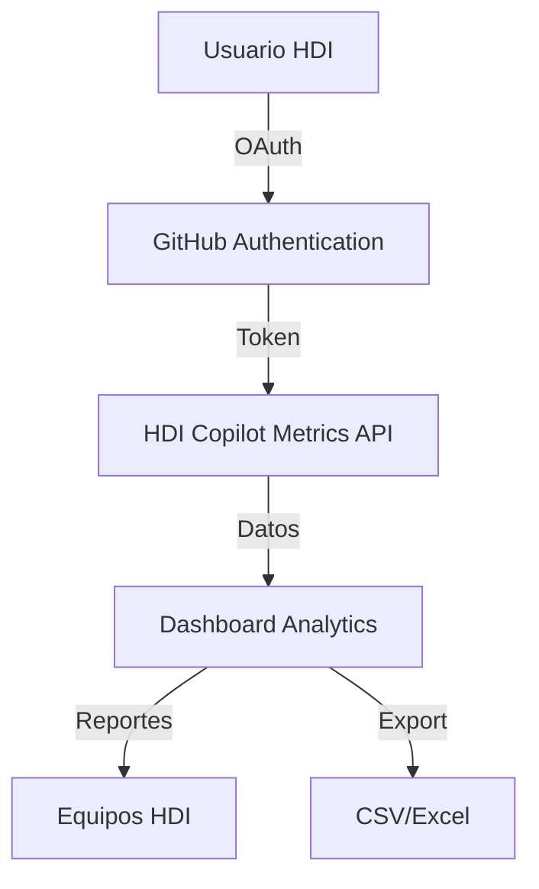

# 🚀 HDI Copilot Metrics Viewer
## Dashboard Profesional de Métricas GitHub Copilot para HDI Chile

<p align="center">
  
  <br>
  <strong>🏢 HDI Seguros Chile</strong> | <strong>🔧 DevOps & Analytics</strong>
</p>

---

## 📊 **Resumen Ejecutivo**

El **HDI Copilot Metrics Viewer** es una aplicación web profesional desarrollada específicamente para **HDI Seguros Chile**, diseñada para monitorear, analizar y optimizar el uso de **GitHub Copilot** en la organización. Esta solución proporciona métricas detalladas, análisis de equipos y reportes ejecutivos para maximizar el ROI de la inversión en IA generativa.

### 🎯 **Objetivos del Proyecto**
- **Monitoreo Continuo**: Seguimiento en tiempo real del uso de GitHub Copilot
- **Análisis de ROI**: Medición del impacto y adopción de IA generativa
- **Optimización de Equipos**: Identificación de patrones de uso y mejores prácticas
- **Reportes Ejecutivos**: Dashboards para toma de decisiones estratégicas

---

## ✅ **Checklist de Mejoras Implementadas**

### 🔐 **Seguridad y Autenticación**
- [x] **GitHub Personal Access Token** configurado y validado
- [x] **Sistema de autenticación OAuth** con `nuxt-auth-utils`
- [x] **Middleware de autenticación** para rutas protegidas
- [x] **Validación de sesiones** con expiración automática
- [x] **Password de sesión** encriptado (32+ caracteres)
- [x] **Modal de validación** de API keys al inicio

### ⚙️ **Configuración y DevOps**
- [x] **Variables de entorno** centralizadas en `.env`
- [x] **Configuración de organizaciones** optimizada (solo `hdicl`)
- [x] **Dockerfile optimizado** para producción
- [x] **Scripts de despliegue** para HDI
- [x] **Configuración de nginx** para HDI
- [x] **Health check endpoints** para Kubernetes

### 🎨 **Experiencia de Usuario**
- [x] **Modal de validación** al inicio del proyecto
- [x] **Checklist visual** de configuración
- [x] **Manejo de errores** mejorado
- [x] **Feedback visual** para estados de validación
- [x] **Interfaz responsive** y profesional

### 📈 **Analytics y Reportes**
- [x] **Métricas de aceptación** de sugerencias
- [x] **Análisis de equipos** y comparativas
- [x] **Exportación CSV** de datos
- [x] **Filtros de fecha** flexibles (hasta 100 días)
- [x] **Análisis de lenguajes** de programación

---

## 🏗️ **Arquitectura Técnica**

### **Stack Tecnológico**
- **Frontend**: Nuxt.js 4.1.1 + Vue.js 3 + Vuetify 3.7.3
- **Backend**: Node.js + TypeScript
- **Autenticación**: GitHub OAuth + nuxt-auth-utils
- **Contenedores**: Docker + Docker Compose
- **Proxy**: Nginx (producción)
- **Monitoreo**: Health checks + Logs estructurados

### **Flujo de Datos**


---

## 🚀 **Instalación y Configuración**

### **Prerrequisitos**
- Node.js 18+ 
- Docker (opcional)
- GitHub Personal Access Token con permisos Copilot
- Acceso a organización `hdicl` en GitHub

### **Configuración Rápida**

1. **Clonar el repositorio:**
```bash
git clone https://github.com/Maurog-castros/copilot-metric-hdi.git
cd copilot-metric-hdi
```

2. **Instalar dependencias:**
```bash
npm install
```

3. **Configurar variables de entorno:**
```bash
# Copiar archivo de configuración
cp config.env .env

# Editar .env con tus credenciales
NUXT_GITHUB_TOKEN=tu_token_aqui
NUXT_SESSION_PASSWORD=HDI-Copilot-Metrics-2025-Super-Secret-Password-32-Chars-Minimum
NUXT_PUBLIC_USING_GITHUB_AUTH=true
```

4. **Ejecutar en desarrollo:**
```bash
npm run dev
```

### **Despliegue en Producción**

#### **Docker (Recomendado)**
```bash
# Construir imagen
docker build -t hdi-copilot-metrics .

# Ejecutar contenedor
docker run -p 8080:80 --env-file .env hdi-copilot-metrics
```

#### **Scripts de Despliegue HDI**
```bash
# Despliegue automático
./deploy-hdi.sh

# Instalación en Linux HDI
./install-hdi-linux.sh
```

---

## 📊 **Funcionalidades Principales**

### **Dashboard Principal**
- **Métricas de Aceptación**: Tasa de aceptación de sugerencias de Copilot
- **Usuarios Activos**: Seguimiento de adopción por equipo
- **Líneas de Código**: Volumen de código generado y aceptado
- **Análisis Temporal**: Tendencias y patrones de uso

### **Análisis de Equipos**
- **Comparativa de Equipos**: Métricas por equipo de desarrollo
- **Identificación de Líderes**: Equipos con mayor adopción
- **Mejores Prácticas**: Compartir estrategias exitosas

### **Reportes y Exportación**
- **CSV Detallado**: Exportación completa de métricas
- **Reportes Ejecutivos**: Resúmenes para gerencia
- **Análisis de ROI**: Medición del impacto en productividad

---

## 🔧 **Configuración Avanzada**

### **Variables de Entorno**

#### **Configuración Básica**
```bash
# Token de GitHub (requerido)
NUXT_GITHUB_TOKEN=ghp_xxxxxxxxxxxxxxxxxxxx

# Password de sesión (mínimo 32 caracteres)
NUXT_SESSION_PASSWORD=HDI-Copilot-Metrics-2025-Super-Secret-Password-32-Chars-Minimum

# Organización HDI
NUXT_PUBLIC_GITHUB_ORG=hdicl
NUXT_PUBLIC_SCOPE=organization
```

#### **Autenticación OAuth (Opcional)**
```bash
# Habilitar autenticación GitHub
NUXT_PUBLIC_USING_GITHUB_AUTH=true

# Credenciales OAuth App
NUXT_OAUTH_GITHUB_CLIENT_ID=tu_client_id
NUXT_OAUTH_GITHUB_CLIENT_SECRET=tu_client_secret
```

### **Configuración de Nginx (Producción)**
```nginx
server {
    listen 80;
    server_name copilot-metrics.hdi.cl;
    
    location / {
        proxy_pass http://localhost:3000;
        proxy_set_header Host $host;
        proxy_set_header X-Real-IP $remote_addr;
    }
}
```

---

## 📈 **Métricas y KPIs**

### **Métricas de Adopción**
- **Tasa de Aceptación**: % de sugerencias aceptadas
- **Usuarios Activos**: Número de desarrolladores usando Copilot
- **Frecuencia de Uso**: Promedio de interacciones por usuario

### **Métricas de Productividad**
- **Líneas Generadas**: Volumen de código creado por IA
- **Tiempo Ahorrado**: Estimación de tiempo de desarrollo
- **Calidad del Código**: Análisis de aceptación por lenguaje

### **Métricas de ROI**
- **Costo por Línea**: Eficiencia de la inversión
- **Adopción por Equipo**: Distribución del uso
- **Tendencias Temporales**: Evolución del uso

---

## 🚨 **Monitoreo y Health Checks**

### **Endpoints de Salud**
- **`/api/health`** - Estado general de la aplicación
- **`/api/ready`** - Verificación de disponibilidad
- **`/api/live`** - Verificación de vida del proceso

### **Configuración Kubernetes**
```yaml
livenessProbe:
  httpGet:
    path: /api/live
    port: 80
  initialDelaySeconds: 30
  periodSeconds: 10

readinessProbe:
  httpGet:
    path: /api/ready
    port: 80
  initialDelaySeconds: 5
  periodSeconds: 5
```

---

## 🔒 **Seguridad y Compliance**

### **Medidas de Seguridad Implementadas**
- **Autenticación OAuth**: Verificación de identidad GitHub
- **Encriptación de Sesiones**: Passwords seguros de 32+ caracteres
- **Validación de API Keys**: Verificación automática de credenciales
- **Middleware de Seguridad**: Protección de rutas sensibles
- **Logs de Auditoría**: Registro de accesos y acciones

### **Cumplimiento HDI**
- **Acceso Restringido**: Solo usuarios autorizados de HDI
- **Datos Corporativos**: Información confidencial protegida
- **Auditoría**: Trazabilidad completa de accesos
- **Backup**: Respaldo automático de configuraciones

---

## 📞 **Soporte y Mantenimiento**

### **Equipo de Desarrollo**
- **Desarrollador Principal**: Mauro Castro (HDI Seguros)
- **Arquitectura**: DevOps & Analytics Team
- **Soporte**: Equipo de TI HDI

### **Canales de Soporte**
- **Issues GitHub**: Para reportar bugs y solicitar features
- **Email Interno**: Para soporte crítico
- **Documentación**: README y comentarios en código

### **Mantenimiento Programado**
- **Actualizaciones**: Mensuales de dependencias
- **Backups**: Diarios de configuraciones
- **Monitoreo**: 24/7 de disponibilidad
- **Reportes**: Semanales de métricas

---

## 📄 **Licencia y Términos**

Este proyecto es propiedad de **HDI Seguros Chile** y está desarrollado específicamente para uso interno corporativo. 

**© 2025 HDI Seguros Chile - Todos los derechos reservados**

---

## 🛠️ **Scripts de Mantenimiento y DevOps**

### **Scripts Disponibles**

#### **Despliegue**
```bash
# Despliegue automático
./deploy-hdi.sh

# Instalación completa en Linux
./install-hdi-linux.sh

# Despliegue con PowerShell (Windows)
./deploy-hdi.ps1
```

#### **Mantenimiento**
```bash
# Mantenimiento completo
./scripts/maintenance.sh full

# Limpieza de logs
./scripts/maintenance.sh clean-logs

# Verificación de salud
./scripts/maintenance.sh health-check

# Optimización de rendimiento
./scripts/maintenance.sh optimize
```

#### **Backup y Restauración**
```bash
# Crear backup completo
./scripts/backup.sh backup

# Restaurar desde backup
./scripts/backup.sh restore /backup/copilot-metrics-backup-20250109_120000.tar.gz

# Listar backups disponibles
./scripts/backup.sh list
```

### **Monitoreo y Observabilidad**

#### **Servicios de Monitoreo**
- **Prometheus**: Métricas de aplicación y sistema
- **Grafana**: Dashboards y visualizaciones
- **Redis**: Cache de sesiones y datos
- **Nginx**: Proxy reverso con métricas

#### **Health Checks**
- **`/api/health`** - Estado general de la aplicación
- **`/api/ready`** - Verificación de disponibilidad
- **`/api/live`** - Verificación de vida del proceso

#### **Logs Estructurados**
- **Aplicación**: Logs JSON con niveles configurables
- **Nginx**: Logs de acceso y errores
- **Docker**: Logs de contenedores
- **Sistema**: Logs del sistema operativo

## 🎯 **Roadmap Futuro**

### **Q1 2025**
- [x] **Configuración completa de DevOps** ✅
- [x] **Scripts de mantenimiento automatizado** ✅
- [x] **Monitoreo con Prometheus y Grafana** ✅
- [x] **Sistema de backup y restauración** ✅
- [ ] Integración con Azure DevOps
- [ ] Reportes automáticos por email
- [ ] Dashboard móvil responsive

### **Q2 2025**
- [ ] Análisis predictivo de adopción
- [ ] Integración con Jira/Confluence
- [ ] API REST para integraciones
- [ ] Alertas automáticas de métricas

### **Q3 2025**
- [ ] Machine Learning para optimización
- [ ] Integración con Power BI
- [ ] Análisis de costos y ROI
- [ ] Integración con sistemas de ticketing

---

<p align="center">
  <strong>🚀 Desarrollado con ❤️ para HDI Seguros Chile</strong>
  <br>
  <em>Maximizando el potencial de GitHub Copilot en la organización</em>
</p>
